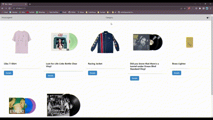

# E-Commerce - MusicLegend



## Construido con
* [ReactJS](https://reactjs.org/)
* [Firebase](https://firebase.google.com)
* [Chakra-UI](https://chakra-ui.com/)

## Dependencias

* [React Router](https://reactrouter.com/)
Esta aplicacion utiliza React Router para crear rutas que rendericen diferentes componentes. Facilita la navegabilidad y le concede un enrutamiento dinámico a la aplicación.

* [Chakra-UI](https://chakra-ui.com/)
Chakra UI es una biblioteca de componentes de interfaz de usuario que facilita la creación de interfaces de usuario atractivas y accesibles. Proporciona componentes personalizables y estilos predefinidos para acelerar el desarrollo de la aplicación.

* [Firebase](https://firebase.google.com/)
Todos los datos de los productos y ordenes de esta aplicacion son gestionados por Firebase.

## Ejecución local
Siga las instrucciones para ver el sitio de manera local.

1. Abrir una nueva terminal y clonar el repositorio con el siguiente comando:
```
    git clone https://github.com/sofiascarpetta/musicStore.git
```

2. Desde la terminal nos ubicamos en la carpeta raíz del proyecto e instalamos todas las dependencias con el comando:
```
    npm install
```

3. Por último corremos nuestro proyecto con el comando:
```
    npm start
```

## Información sobre desarrollo
### Rutas
* **Main** *("/")*: Esta compuesto por un Navbar el cual renderiza el logo de la tienda, un menú para acceder a las distintas categorías de productos y un container con todos los productos existentes en la base de datos.
* **Category** *("/category/:categoryId")*: Renderiza productos filtrados en base a su categoría.
* **Item** *("/detail/:productId")*: Renderiza un card con los detalles del producto seleccionado (nombre, descripción, imágen, stock). También tiene disponible un botón que es el encargado de agregar cierta cantidad del producto al carrito, una vez agregado el producto, se renderiza un botón de "Checkout" que redirecciona al usuario a su carrito de compras.
* **Cart** *("/cart")*: Renderiza el carrito de compras con los productos agregados por el usuario.
* **Order** *("/order")*: Renderiza un formulario para generar una orden en la base de datos, al enviar el formulario si todos los campos están bien renderiza un cartel con el ID de la orden generada. 